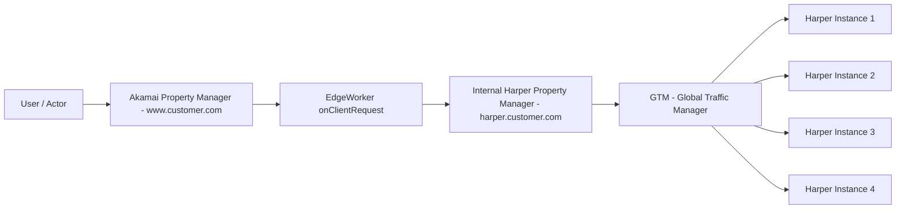

# Harper Early Hints & Redirect Architecture

This document provides a clear architectural overview of the Harper Early Hints and Redirect workflow, including a Mermaid-based diagram suitable for GitHub rendering, along with an explanation of each component.

---

## Architecture Flow Diagram

---

## Explanation of Workflow

### 1. **User Request → Akamai Property Manager**

The end user makes a request to the primary Akamai-delivered domain (e.g., `www.customer.com`). This traffic lands on the Akamai Property Manager configuration, which serves as the control layer for behaviors, metadata, and logic.

---
