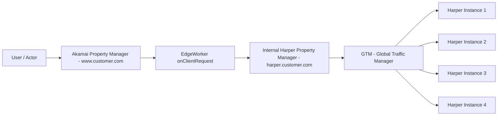

# Harper Early Hints & Redirect Architecture

This document provides a clear architectural overview of the Harper Early Hints and Redirect workflow, including a Mermaid-based diagram suitable for GitHub rendering, along with an explanation of each component.

---

## Architecture Flow Diagram

---

## Explanation of Workflow

### 1. **User Request → Akamai Property Manager**

The end user makes a request to the primary Akamai-delivered domain (e.g., `www.customer.com`). This traffic lands on the Akamai Property Manager configuration, which serves as the control layer for behaviors, metadata, and logic.

### 2. **Akamai Property Manager → EdgeWorker (onClientRequest)**

During the request lifecycle, the EdgeWorker executes at the onClientRequest phase, where the EdgeWorker performs logic such as redirect evaluation, Early Hints generation. If real-time decisioning is required, it makes a subrequest to the internal Harper endpoint.

### 3. **EdgeWorker → Internal Harper Property Manager (harper.customer.com)**

The EdgeWorker forwards a controlled subrequest to an internal “ghost” Property Manager configuration (e.g., harper.customer.com). This property is not user-facing and acts as a routing layer between Akamai edge logic and the Harper backend infrastructure. It ensures consistent request handling before passing traffic to GTM.

### 4. **Internal Harper Property Manager → GTM (Global Traffic Manager)**

The request is then routed to GTM. GTM is responsible for global load balancing, Perf-based routing, datacenter selection, and failover handling. It evaluates liveness checks, traffic weights, and availability status to determine the optimal Harper instance to serve the request.

### 5. **GTM → Harper Instances**

GTM distributes the request across multiple Harper backend instances. These instances process the request and return structured responses that may include redirect decisions, Early Hints suggestions etc. The response flows back through GTM → Internal Harper PM → EdgeWorker → Akamai Property Manager → User.

---
